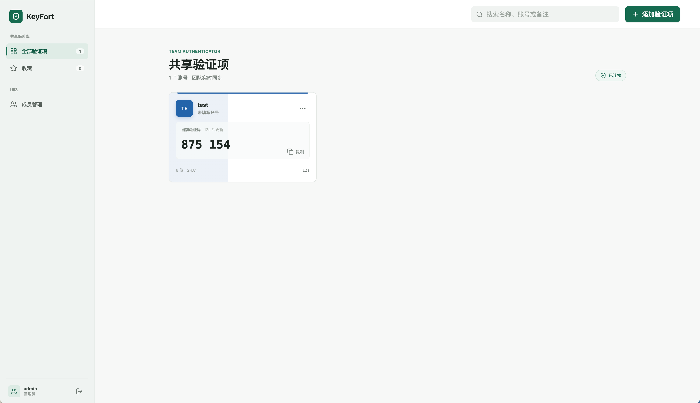

# KeyFort

KeyFort 是一个面向团队的 TOTP 验证码共享管理器。团队成员登录后访问统一的验证码保险库，服务端负责生成验证码，并使用独立加密密钥保护 TOTP Secret Key。



## 产品能力

- 首次启动创建团队管理员
- 邮箱密码登录与安全 Session
- 管理员添加、移除团队成员
- 管理员与普通成员角色
- 团队共享 TOTP 验证项
- 名称、账号、服务商、备注与颜色标记
- Base32 Secret Key 和 `otpauth://` 链接
- 6、7、8 位验证码
- 30、60 秒周期
- SHA1、SHA256、SHA512 算法
- 服务端实时生成验证码，前端每秒同步
- AES-256-GCM 加密 Secret Key
- 收藏、搜索、一键复制和删除
- 管理员可以为指定验证项开启无需登录访问
- 未登录用户可以查看已公开验证项的实时验证码
- 无需账号即可进入本地试用模式
- 本地试用数据保存在当前浏览器

## 数据安全

团队数据统一保存于服务端 SQLite 数据库：

```text
data/keyfort.db
```

TOTP Secret Key 使用 AES-256-GCM 加密，服务端加密密钥通过环境变量配置：

```env
TOTP_ENCRYPTION_KEY
```

开发环境未设置该变量时，应用会在首次启动时生成：

```text
data/encryption.key
```

生产部署需要固定配置 `TOTP_ENCRYPTION_KEY`。加密密钥是恢复数据库中 TOTP Secret Key 的必要凭证，请使用部署平台的 Secret 管理功能保存。

用户密码以 bcrypt 哈希形式保存。登录 Session 保存在 SQLite，并通过 HttpOnly Cookie 传递。

## 公开访问

管理员可以在添加或编辑验证项时打开“无需登录访问”。开启后，该验证项会出现在独立的 `/public` 公开访问页面，未登录用户可以查看名称、账号和实时验证码。登录页只提供“查看公开验证码”导航入口。

`server/config.json` 中配置的默认验证项会作为公开验证项展示在 `/public`，并从登录后的团队验证项列表中独立排除。管理员在首次创建团队时可以直接使用默认配置，之后仍可在团队页面中维护其他验证项。

公开接口只返回必要的展示字段、验证码和倒计时，不返回 Secret Key。公开访问适合访客账号、演示账号或需要快速共享的一次性场景。重要的生产凭证建议保持关闭。

## 路由

- `/`：团队登录和本地试用入口
- `/accounts`：全部团队验证项
- `/favorites`：收藏验证项
- `/team`：管理员成员管理页面
- `/public`：无需登录的公开验证码页面

普通成员和本地试用用户访问 `/team` 时会回到 `/accounts`。公开页面与团队工作区独立，返回时会保留当前登录或本地试用状态。


登录页提供“无需账号，本地试用”入口。试用模式的数据和 Secret Key 保存在当前浏览器 `localStorage`，刷新页面后可以继续使用，也不会上传到团队服务端。

本地试用没有密码保护，适合体验功能或保存非敏感验证项。团队凭证和重要账号建议使用登录后的服务端加密保险库。

## 默认验证项

默认验证项配置位于服务端 [server/config.json](server/config.json)，由 API 服务读取：

```json
{
  "defaultAccount": {
    "name": "示例账号",
    "account": "demo@example.com",
    "issuer": "KeyFort Demo",
    "secret": "JBSWY3DPEHPK3PXP",
    "digits": 6,
    "period": 30,
    "algorithm": "SHA1",
    "notes": "演示账号"
  }
}
```

也可以通过环境变量设置默认密钥：

```env
DEFAULT_TOTP_SECRET=JBSWY3DPEHPK3PXP
```

默认验证项在首次创建管理员时初始化一次。生产 Secret Key 建议使用环境变量或部署平台的 Secret 管理功能。

## 开发

复制 [env.example](env.example) 为 `.env`，按需修改配置：

```bash
cp env.example .env
pnpm install
pnpm dev
```

`pnpm dev` 同时运行：

- React/Vite：`http://localhost:5173`
- API 服务：`http://localhost:3001`

Vite 将 `/api` 请求代理到 API 服务。前端环境变量可以放在 `client-env/` 目录，服务端 `.env` 只由 Node.js 读取。首次打开页面创建管理员账号，再通过“成员管理”添加团队成员。

## Docker 部署

KeyFort 提供 GitHub Actions 镜像与版本发布流程，以及 Compose 运行配置。GitHub Actions 配置位于 [.github/workflows/docker.yml](.github/workflows/docker.yml)：推送到 `main` 时会更新 GHCR 镜像；创建 `v*.*.*` 版本标签时，会发布对应版本镜像并自动创建 GitHub Release 和 Release Notes。

```text
ghcr.io/<github-owner>/keyfort:latest
ghcr.io/<github-owner>/keyfort:<tag>
```

发布版本示例：

```bash
git tag v2.0.0
git push origin v2.0.0
```

版本标签包含 `-` 时，例如 `v2.1.0-beta.1`，GitHub Release 会自动标记为预发布版本。Release 页面会包含自动生成的变更说明、版本镜像拉取命令和对应提交哈希。

Compose 文件只负责运行已经构建好的镜像。镜像构建由 GitHub Actions 或 Makefile 完成。

首次使用 Docker：

```bash
make init
# 如果 GitHub 用户名不是 alterem，在 .env 中修改 KEYFORT_IMAGE
make up
```

常用命令：

```bash
make up          # 拉取镜像并启动服务
make up-build    # 使用 Dockerfile 构建本地镜像后启动
make build       # 只构建本地镜像
make down        # 停止服务
make logs        # 查看日志
make ps          # 查看服务状态
make pull        # 拉取指定镜像并启动
make backup      # 导出 SQLite 数据卷
make destroy     # 停止服务并删除数据卷
```

使用其他 GitHub 仓库镜像：

```bash
make pull IMAGE=ghcr.io/<github-owner>/keyfort:latest
```

也可以直接使用 Compose：

```bash
cp env.example .env
# 在 .env 中配置 TOTP_ENCRYPTION_KEY 和 KEYFORT_IMAGE
docker compose pull
docker compose up -d
```

Compose 使用名为 `keyfort-data` 的 Docker volume 保存 SQLite 数据和加密密钥。删除该 volume 会使团队数据和密钥无法恢复，请先执行 `make backup`。

## 生产部署

```bash
pnpm build
NODE_ENV=production TOTP_ENCRYPTION_KEY="$(openssl rand -base64 32)" pnpm start
```

生产环境建议使用 HTTPS，保护登录 Cookie 与团队数据传输。

## 项目检查

```bash
pnpm test
pnpm lint
pnpm build
```

## 许可证

KeyFort 使用 MIT License，完整条款见 [LICENSE](LICENSE)。

- React
- TypeScript
- Vite
- Node.js
- Express
- SQLite / better-sqlite3
- bcryptjs
- OTPAuth
- Node Crypto
- Radix UI / shadcn 风格组件
- Lucide React
